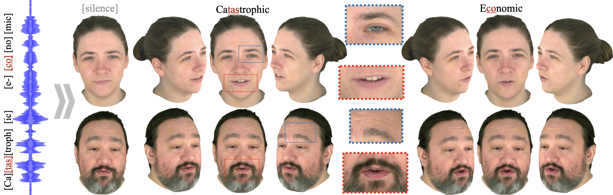

## GaussianSpeech: Audio-Driven Gaussian Avatars Official PyTorch implementation of the paper

**GaussianSpeech: Audio-Driven Gaussian Avatars** 
Shivangi Aneja,  Artem Sevastopolsky,  Tobias Kirschstein, Justus Thies, Angela Dai, Matthias Niessner 
https://shivangi-aneja.github.io/projects/gaussianspeech  

Abstract: *We introduce GaussianSpeech, a novel approach that synthesizes high-fidelity animation sequences of photo-realistic, personalized 3D human head avatars from spoken audio. To capture the expressive, detailed nature of human heads, including skin furrowing and finer-scale facial movements, we propose to couple speech signal with 3D Gaussian splatting to create realistic, temporally coherent motion sequences. We propose a compact and efficient 3DGS-based avatar representation that generates expression-dependent color and leverages wrinkle- and perceptually-based losses to synthesize facial details, including wrinkles that occur with different expressions. To enable sequence modeling of 3D Gaussian splats with audio, we devise an audio-conditioned transformer model capable of extracting lip and expression features directly from audio input. Due to the absence of high-quality datasets of talking humans in correspondence with audio, we captured a new large-scale multi-view dataset of audio-visual sequences of talking humans with native English accents and diverse facial geometry. GaussianSpeech consistently achieves state-of-the-art performance with visually natural motion at real time rendering rates, while encompassing diverse facial expressions and styles.*

 

### Source Code & Dataset Coming Soon!